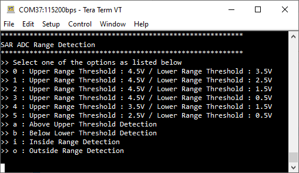

# ADC Range Detection

**This code example demonstrates the ADC range detection feature of the SAR ADC module. This feature is useful to monitor whether the converted result of ADC voltage is within the required range.**

## Device

The device used in this code example (CE) is:
- [TRAVEO™ T2G CYT4BF Series](https://www.infineon.com/cms/en/product/microcontroller/32-bit-traveo-t2g-arm-cortex-microcontroller/32-bit-traveo-t2g-arm-cortex-for-body/traveo-t2g-cyt4bf-series/)

## Board

The board used for testing is:
- TRAVEO™ T2G evaluation kit ([KIT_T2G-B-H_LITE](https://www.infineon.com/cms/en/product/evaluation-boards/kit_t2g-b-h_lite/))

## Scope of work

In this example, the ADC range detection feature is configured to trigger an interrupt whenever the ADC output voltage goes out of the range marked by user-selected threshold voltages. The onboard potentiometer is used to provide input voltage level to the selected ADC channel. Optionally, an external waveform generator can be used to provide an adequate ADC input signal. The onboard USER_LED is switched on whenever the ADC input voltage goes out of range.

## Introduction  

**SAR ADC**  

TRAVEO™ T2G features a successive approximation register analog-to-digital converter (SAR ADC), The SAR ADC is designed for applications that require a moderate resolution and high data rate. It consists of the following blocks:
- SARADC Core
- SARMUX
- SAR sequencer
- Diagnostic reference
- Reference buffer

SARMUX is an analog multiplexer to connect the signal sources to the ADC input. The SARADC core then perform the analog-to-digital conversion. A SAR sequencer is responsible for prioritizing the trigger requests, enabling the appropriate analog channel, and controlling the sampling.

TRAVEO™ T2G platform supports the following ADC features:
- Three SAR A/D converters with up to 96 external channels
- Each ADC supports 12-bit resolution and sampling rates of up to 1 Msps
- Each ADC also supports six internal analog inputs like 
   - Bandgap reference to establish absolute voltage levels
   - Calibrated diode for junction temperature calculations
   - Two AMUXBUS inputs and two direct connections to monitor supply levels
- Each ADC has a sequencer supporting the autonomous scanning of configured channels
- Synchronized sampling of all ADCs for motor-sense applications

**ADC Range Detection**

The SAR sequencer supports an optional range detection feature. Range detection enables a check against up to two programmable threshold values without CPU involvement. 

Range detection is defined by two 16-bit threshold values and a mode field selecting one of four possible modes.

Both the mode *PASSx_SARy_CHz_POST_CTL.RANGE_MODE* and the two thresholds *PASSx_SARy_CHz_RANGE_CTL.RANGE_LO* and *PASSx_SARy_CHz_RANGE_CTL.RANGE_HI* are configured per channel. 

The available range detection modes are:
- *BELOW_LO* (RESULT < RANGE_LO) 
- *INSIDE_RANGE* (RANGE_LO ≤ RESULT < RANGE_HI)
- *ABOVE_HI* (RANGE_HI ≤ RESULT)
- *OUTSIDE_RANGE* (RESULT < RANGE_LO) || (RANGE_HI ≤ RESULT) 

Range detection uses the 16-bit *PASSx_SARy_CHz_RESULT.RESULT* from the "left/right align" step. This means that the threshold values need to be in the same format as the  *PASSx_SARy_CHz_RESULT.RESULT* after all the preceding post-processing steps (including averaging). The event flag will be set when the range mode condition evaluates to *true*.
                                                         
When the event flag is set, the *PASSx_SARy_CHz_INTR.CH_RANGE* interrupt will be set and a pulse is output on the range violation trigger.

More details can be found in [Technical Reference Manual (TRM)](https://www.infineon.com/dgdl/?fileId=5546d4627600a6bc017600bfae720007), [Registers TRM](https://www.infineon.com/dgdl/?fileId=5546d4627600a6bc017600be2aef0004) and [Data Sheet](https://www.infineon.com/dgdl/?fileId=5546d46275b79adb0175dc8387f93228).

## Hardware setup

This CE has been developed for:
- TRAVEO™ T2G evaluation kit lite ([KIT_T2G-B-H_LITE](https://www.infineon.com/cms/en/product/evaluation-boards/kit_t2g-b-h_lite/)) 
   
No changes are required from the board's default settings.

The onboard potentiometer *VR1* can be used to define a voltage level connected to an ADC input channel. Alternatively, a waveform generator can be connected to the same ADC input channel by using *pin 1* of Arduino *connector J15*. In that case ensure that the potentiometer is set to a middle position to avoid that the potentiometer output has GND or 5V potential.

Please refer to the board schematic for more details on how the potentiometer is connected to the ADC.

A UART serial connection should be made with the computer via the serial port (KitProg3 connector). Use a terminal emulator to see the output on the screen. In the terminal emulator settings, select the KitProg3 COM port and set the baud rate to 115200. 

## Implementation

In this design, an onboard potentiometer is used to provide input to the SAR ADC. The input voltage ranges from 0V to 5V. The main function displays the available options for the threshold values and the range detection mode on the terminal program. The user can then enter the corresponding keys to make a selection.

When the voltage is out of the range chosen by the user, an interrupt is triggered and the onboard *USER_LED* is turned on. Alternatively, the signal can also be measured on *pin 8* of *connector X2*.

**STDOUT/STDIN setting**

Initialization of the GPIO for UART is done in the <a href="https://infineon.github.io/retarget-io/html/group__group__board__libs.html#gaddff65f18135a8491811ee3886e69707"><i>cy_retarget_io_init()</i></a> function.
- Initializes the pin specified by *CYBSP_DEBUG_UART_TX* as UART TX and the pin specified by *CYBSP_DEBUG_UART_RX* as UART RX (these pins are connected to KitProg3 COM port)
- The serial port parameters are 8N1 and 115200 baud

**GPIO pin configuration**

The *CYBSP_USER_LED* is configured to output mode. This LED is later turned on to indicate voltage out of range.

The *CYBSP_POT* port pin which is connected to the onboard potentiometer is configured as analog input and connected to the configured ADC channel.

**SAR ADC initialization**

SAR ADC instance and channel are configured by calling <a href="https://infineon.github.io/mtb-pdl-cat1/pdl_api_reference_manual/html/group__group__sar2__functions.html#gad6ddc69b82b06fda5952c5da00de35ed"><i>Cy_SAR2_Init()</i></a> with appropriate arguments using macros and configuration structure <a href="https://infineon.github.io/mtb-pdl-cat1/pdl_api_reference_manual/html/structcy__stc__sar2__config__t.html"><i>cy_stc_sar2_config_t</i></a> configured by Device Configurator:

*Figure 1. ADC configuration* 

**User input**

Using UART serial communication, a list of available reference voltages is displayed on the terminal emulator. The user can enter the corresponding key to choose a pair of defined upper and lower threshold voltage levels for ADC range detection. In addition, the different ADC range detection modes can be selected.

**Code example main loop**

The endless loop of the code example in *main()* always checks whether a character has been received from the user via UART (terminal) using <a href="https://infineon.github.io/mtb-hal-cat1/html/group__group__hal__uart.html#ga89108b2d339dc9863ec660588e3a4a12"><i>cyhal_uart_getc()</i></a>. The user interface supports numeric values ranging from *0 - 5* and alphabetic characters *a, b, i* and *o*. Any other key input will be ignored.

The character received is then used to set the ADC range parameters such as the detection mode, the upper and the lower threshold values by calling the function *configureAdcRangeDetectionMode()*. In this function the ADC is temporarily disabled by calling <a href="https://infineon.github.io/mtb-pdl-cat1/pdl_api_reference_manual/html/group__group__sar2__functions.html#ga3c9fe108014e660a2a2fdbfd51498641"><i>Cy_SAR2_Disable()</i></a>, then the *PASSx_SARy_CHz_RANGE_CTL.RANGE_HI* and *PASSx_SARy_CHz_RANGE_CTL.RANGE_LO* and *PASSx_SARy_CHz_POST_CTL.RANGE_MODE* fields are written by the PDL driver API <a href="https://infineon.github.io/mtb-pdl-cat1/pdl_api_reference_manual/html/group__group__sar2__functions.html#gad6ddc69b82b06fda5952c5da00de35ed"><i>Cy_SAR2_Init()</i></a> for the configured ADC instance and channel. The SAR ADC block is then re-enabled using the API <a href="https://infineon.github.io/mtb-pdl-cat1/pdl_api_reference_manual/html/group__group__sar2__functions.html#gae928dc6cfa80e6ee015be6aac6fc759e"><i>Cy_SAR2_Enable()</i></a>. Next, the *handleAdcIrq()* function is setup as an interrupt handler and the system and CPU interrupts are enabled by calling <a href="https://infineon.github.io/mtb-pdl-cat1/pdl_api_reference_manual/html/group__group__sysint__functions.html#gab2ff6820a898e9af3f780000054eea5d"><i>Cy_SysInt_Init()</i></a> and *NVIC_EnableIRQ()*. As a last step, the channel interrupt is configured using <a href="https://infineon.github.io/mtb-pdl-cat1/pdl_api_reference_manual/html/group__group__sar2__functions.html#gaec97a2bde0497f5e95deb60a5e9d081a"><i>Cy_SAR2_Channel_SetInterruptMask()</i></a> and the A/D conversion is triggered by calling the API <a href="https://infineon.github.io/mtb-pdl-cat1/pdl_api_reference_manual/html/group__group__sar2__functions.html#ga07a7023e4f6db655204d25a21b036651"><i>Cy_SAR2_Channel_SoftwareTrigger()</i></a>. The ADC will be re-triggered by hardware in continuous mode.

**A/D conversion**

The ADC is configured in continuous mode, which means that, since it is triggered once the SAR ADC is retriggering the following conversions autonomously. The clock and conversion timing is set with parameters that every 1 microsecond a new ADC conversion is done. 

When an ADC range event is detected the interrupt callback function *handleAdcIrq()* is called where a flag variable will be set. The main loop will set the *USER_LED* port pin to *high* when an event has been detected or otherwise to *low*. This means the *USER_LED* is illustrating whether there is an ADC range detection event. The signal can also be measured on connector pin *X2.8*. 

## Run and Test

For this example, a terminal emulator is required for displaying outputs and to change settings during runtime. Install a terminal emulator if you do not have one. Instructions in this document use [Tera Term](https://ttssh2.osdn.jp/index.html.en).

After code compilation, perform the following steps for flashing the device:
1. Connect the board to your PC using the provided USB cable through the KitProg3 USB connector. 
2. Open a terminal program and select the KitProg3 COM port. Set the serial port parameters to 8N1 and 115200 baud.
3. Program the board using one of the following:
    - Select the code example project in the Project Explorer.
    - In the **Quick Panel**, scroll down, and click **[Project Name] Program (KitProg3_MiniProg4)**.
4. After programming, the code example starts automatically. Confirm that the messages are displayed on the UART terminal:

   *Figure 2. User Menu* 
   
   A list of upper and lower threshold voltage levels is displayed. Also, different range detection modes, outside range, inside range, above upper threshold and below lower threshold. The user can select an option by entering the corresponding character.

5. You can debug the example to step through the code. In the IDE, use the **[Project Name] Debug (KitProg3_MiniProg4)** configuration in the **Quick Panel**. For details, see the "Program and debug" section in the [Eclipse IDE for ModusToolbox™ software user guide](https://www.cypress.com/MTBEclipseIDEUserGuide).

**Note:** **(Only while debugging)** On the CM7 CPU, some code in *main()* may execute before the debugger halts at the beginning of *main()*. This means that some code executes twice: once before the debugger stops execution, and again after the debugger resets the program counter to the beginning of *main()*. See [KBA231071](https://community.cypress.com/docs/DOC-21143) to learn about this and for the workaround.

**Expected behavior**

For illustration purposes, different ADC range detection configurations are selected. For each test, a triangle waveform signal (0 - 5V) was applied to the ADC input (*ADCin* in oscilloscope pictures below). However, similar results can also be achieved by using the potentiometer. The implementation ensures that the *USER_LED* is set to high each time the range detection event has been triggered or to low if the event stops to occur.

- Test 1 - Outside Range Detection: Upper threshold = 3.5V, lower threshold = 1.5V  
  Whenever *ADCin* is above 3.5V OR below 1.5V the *OuterRangeDetection* signal (*USER_LED*) pin is set to high.

  *Figure 3. Outside Range Detection*  

- Test 2 - Inside Range Detection: Upper threshold = 3.5V, lower threshold = 1.5V  
  Whenever *ADCin* is between 1.5V AND 3.5V the *InnerRangeDetection* signal (*USER_LED*) pin is set to high.

  *Figure 4. Inside Range Detection*  

- Test 3 - Above Upper Threshold Detection: Upper threshold = 3.5V  
  Whenever *ADCin* is above 3.5V the *AboveUpperThDetection* signal (*USER_LED*) pin is set to high.

  *Figure 5. Above Upper Threshold Detection*  

- Test 4 - Below Lower Threshold Detection: Lower threshold = 1.5V  
  Whenever *ADCin* is below 1.5V the *BelowLowerThDetection* signal (*USER_LED*) pin is set to high.

  *Figure 6. Below Lower Threshold Detection*  

## References

Relevant Application notes are:
- AN235305 - GETTING STARTED WITH TRAVEO™ T2G FAMILY MCUS IN MODUSTOOLBOX™
- [AN219755](https://www.infineon.com/dgdl/?fileId=8ac78c8c7cdc391c017d0d3aaebf676a) - USING A SAR ADC IN TRAVEO™ T2G AUTOMOTIVE MICROCONTROLLERS

ModusToolbox™ is available online:
- <https://www.infineon.com/modustoolbox>

Associated TRAVEO™ T2G MCUs can be found on:
- <https://www.infineon.com/cms/en/product/microcontroller/32-bit-traveo-t2g-arm-cortex-microcontroller/>

More code examples can be found on the GIT repository:
- [TRAVEO™ T2G Code examples](https://github.com/orgs/Infineon/repositories?q=mtb-t2g-&type=all&language=&sort=)

For additional training, visit our webpage:  
- [TRAVEO™ T2G training](https://www.infineon.com/cms/en/product/microcontroller/32-bit-traveo-t2g-arm-cortex-microcontroller/32-bit-traveo-t2g-arm-cortex-for-body/traveo-t2g-cyt4bf-series/#!trainings)

For questions and support, use the TRAVEO™ T2G Forum:  
- <https://community.infineon.com/t5/TRAVEO-T2G/bd-p/TraveoII>  
